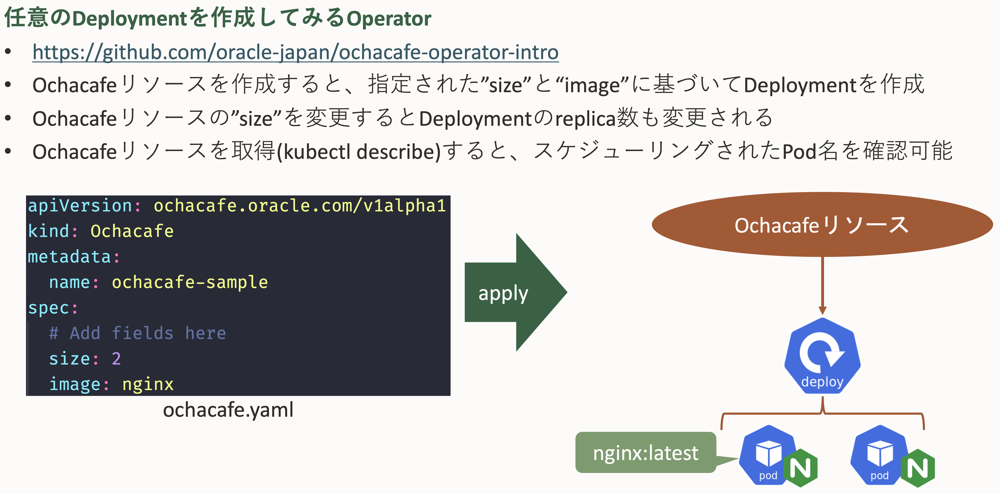

# [OCHaCafe Season5 #1 「Kubernetes Operator超入門」](https://ochacafe.connpass.com/event/232810/)のなんちゃってHelidonOperator

## 1. このOperatorが行うこと



- 補足
  - Operatorに定義しているコンテナイメージを変更すれば任意のコンテナイメージをデプロイすることも可能

## 2. Operatorのデプロイ

### 共通手順

```sh
vim Makefile
```

32行目の`IMAGE_TAG_BASE`を任意のコンテナ・レジストリパスに変更

```sh
IMAGE_TAG_BASE ?= oracle.com/ochacafe-operator-intro
```

例：

```sh
IMAGE_TAG_BASE ?= nrt.ocir.io/orasejapan/helidon_operator
```

### OLM(Operator Lifecyle Management)を利用する場合

- 前提条件
  - operator-sdkコマンドがインストールされていること
    - [こちらを参照](https://sdk.operatorframework.io/docs/installation/)
  - Kubernetesクラスタに対して`kubectl`コマンドでアクセスできること

#### 1.OLMのインストール

```sh
operator-sdk olm install --version=v0.18.3
```

#### 2.Operatorコンテナイメージのビルドとプッシュ

```sh
make bundle bundle-build bundle-push
```

#### 3.デプロイ

```sh
operator-sdk run bundle <プッシュ先のコンテナ・レジストリのフルパス>
```

例：

```sh
operator-sdk run bundle nrt.ocir.io/orasejapan/helidon_operator-bundle:v0.0.1
```

### ダイレクトデプロイを利用する場合

#### 1.Operatorコンテナイメージのビルドとプッシュ

```sh
make docker-build docker-push
```

#### 2.デプロイ

```sh
make deploy 
```

## 3.CR(カスタム・リソース)のデプロイ

```sh
kuebctl apply -f config/samples/ochacafe_v1alpha1_helidon.yaml
```

## 4.クリーンアップ

#### OLM(Operator Lifecyle Management)を利用した場合

```sh
operator-sdk olm uninstall
```

#### ダイレクトデプロイを利用した場合

```sh
make undeploy
```